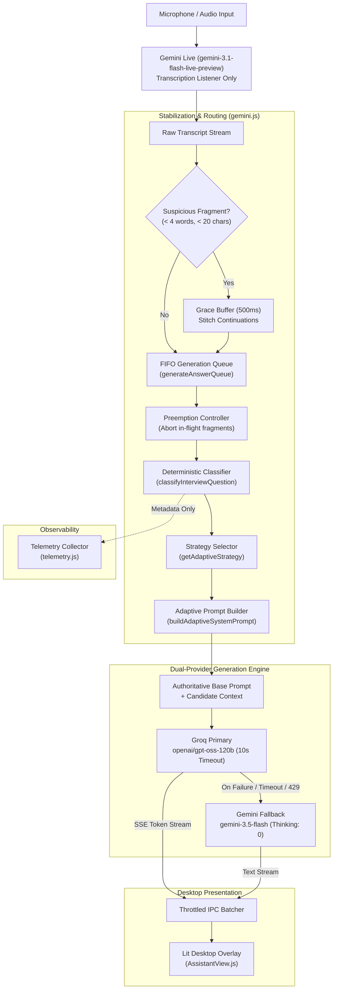

# MeetPilot AI

MeetPilot AI is a low-latency, desktop interview and meeting copilot built with Electron. It captures live spoken interviewer audio, transcribes it in real time using Google Gemini Live, classifies the technical question type locally in microseconds, selects a specialized interview response strategy, and streams concise, speakable answers using Groq with automatic Gemini HTTP fallback.

Designed specifically for live spoken interaction, MeetPilot AI prioritizes speed, conversation flow, and structured answers tailored to technical interviews (Coding, System Design, Behavioral, Experience, Conceptual, and Follow-up probes).

---

## Key Capabilities

- **Real-Time Speech-to-Text**: Continuous streaming audio transcription powered by Gemini Live (`gemini-3.1-flash-live-preview`) operating in a transcription-only listener mode.
- **Adaptive Interview Intelligence**: Deterministic, local question classifier that detects 7 canonical question types and applies specialized answer structures (e.g., STAR framework for behavioral, approach/code/complexity for coding).
- **Fast Answer Generation**: Primary answer generation through Groq (`openai/gpt-oss-120b` and `openai/gpt-oss-20b`) for rapid time-to-first-token (TTFT).
- **Automatic High-Availability Fallback**: Transparent failover to Gemini HTTP (`gemini-3.5-flash`) on Groq timeout, rate limits (429), model unavailability (404), or network disconnection.
- **Speech Stabilization & Continuation Stitching**: 500ms fragment grace buffer with continuation stitching to prevent premature mid-sentence question cuts.
- **Preemptible Fragment Generation**: In-flight generation triggered by incomplete speech fragments is aborted immediately via `AbortController` when a complete question arrives.
- **FIFO Generation Queue**: Concurrency serialization queue prevents race conditions, interleaved responses, and UI collision.
- **Transparent Always-On-Top Overlay**: Unobtrusive, click-through capable desktop overlay built with Lit web components and styled markdown rendering.
- **Privacy-Preserving Telemetry**: Structured latency and classification telemetry with SHA-256 fingerprinting that excludes candidate resume content and sensitive system prompts.

---

## Real-Time Architecture

The MeetPilot AI pipeline is designed around a strict unidirectional flow: speech is transcribed, stabilized, classified locally, and routed to the generation engine, which streams tokens directly to the overlay UI.



### Component Roles

| Component | Technology | Role |
|---|---|---|
| **Audio Listener** | Google Gemini Live API | Listens to incoming audio chunks via WebSockets. Configured with a system instruction to remain silent (audio output disabled) and act strictly as an STT engine. |
| **Pipeline Manager** | Node.js / Electron Main | Coordinates VAD events, holds fragments, manages the FIFO execution chain, and tracks quotas. |
| **Question Classifier** | Regex Rule Engine (`prompts.js`) | Evaluates questions and conversation history synchronously in $< 0.01\text{ms}$ with zero external API calls. |
| **Primary Generator** | Groq Cloud API | Generates real-time interview answers via streaming chat completions with an enforced 10-second timeout. |
| **Fallback Generator** | Google Gemini API (`@google/genai`) | Serves as an immediate hot fallback if Groq encounters timeouts, rate limits, or HTTP errors. Thinking budget is explicitly set to 0 to prevent latency penalties. |
| **Overlay UI** | Electron Renderer + Lit | Renders syntax-highlighted markdown into a transparent, movable, always-on-top window. |

---

## Phase 4: Adaptive Interview Intelligence

Generic interview assistants deliver uniform, essay-like answers regardless of question type. MeetPilot AI Phase 4 introduced a deterministic, lightweight classification engine that adapts the answer format to the expectations of technical interviewers.

### The 7 Canonical Question Types

```
User Question + History
        │
        ▼
classifyInterviewQuestion()
        │
        ├─► FOLLOW_UP      ──► Immediate Delta (No Repetition)
        ├─► BEHAVIORAL     ──► STAR Framework (Situation, Task, Action, Result)
        ├─► EXPERIENCE     ──► First-Person Ownership & Technical Rationale
        ├─► CODING         ──► Approach ➔ Code Block ➔ Time/Space Complexity
        ├─► SYSTEM_DESIGN  ──► Architecture ➔ Data/Storage ➔ Scalability & Trade-offs
        ├─► CONCEPTUAL     ──► Definition ➔ Mechanics/Differences ➔ Example
        └─► GENERAL        ──► Direct, Concise Conversational Response
```

| Type | Strategy Description | Output Structure |
|---|---|---|
| **`CODING`** | Algorithmic problems and data structure implementations. | **1. Approach**: 1–2 bullets on intuition.<br/>**2. Code**: Clean markdown block.<br/>**3. Complexity**: Big-O Time & Space with 1-line rationale. |
| **`SYSTEM_DESIGN`** | High-level distributed architecture and scaling questions. | **1. Architecture**: Core components and data flow.<br/>**2. Data & Storage**: Database choices, schema, sharding.<br/>**3. Scalability & Trade-offs**: Caching, bottlenecks, consistency vs availability. |
| **`BEHAVIORAL`** | Conflict resolution, leadership, and past behavior questions. | **1. Situation & Task**: Concise challenge framing.<br/>**2. Action**: 2–3 bullets on personal technical leadership/actions.<br/>**3. Result**: Measurable business outcome and takeaways. |
| **`EXPERIENCE`** | Inquiries about resume projects, past roles, or technology choices. | **1. Personal Ownership**: First-person narrative ("I designed...", "My role was...").<br/>**2. Technical Rationale**: Why chosen over alternatives.<br/>**3. Impact**: Quantifiable outcome. |
| **`CONCEPTUAL`** | Core computer science fundamentals and theoretical concepts. | **1. Direct Definition**: 1 crisp sentence.<br/>**2. Key Mechanics**: 2–3 bullets contrasting options or mechanics.<br/>**3. Practical Example**: Real-world analogy or use case. |
| **`FOLLOW_UP`** | Probing questions referencing immediate context (e.g., *"Why Redis?"*). | **1. Immediate Answer**: Directly targets the delta.<br/>**2. Tight Rationale**: 1–2 bullets on trade-offs.<br/>*(Explicitly forbids repeating or summarizing the previous turn)*. |
| **`GENERAL`** | Conversational checks, audio tests, and greetings. | Direct, professional, speakable response in 1–3 sentences. |

### Technical Characteristics of the Classifier
- **Zero Network Calls**: Runs locally in process memory via regular expression analysis and context evaluation.
- **Latency**: Measured at approximately **$3.8\ \mu\text{s}$ ($0.0038\text{ ms}$)** per evaluation, introducing negligible overhead relative to LLM generation.
- **Authoritative Prompt Composition**: The base system prompt and user candidate profile are preserved verbatim. Adaptive instructions are appended as structural decorators (`buildAdaptiveSystemPrompt`).
- **Groq & Gemini Parity**: The composed adaptive system prompt is identical across Groq primary generation and Gemini HTTP fallback.

---

## Engineering Highlights & Reliability Work

MeetPilot AI has been hardened through extensive performance and reliability phases:

1. **Gemini Live Transcription-Only Enforcement**  
   Gemini Live is prompted specifically with instructions to suppress verbal audio responses. Incoming audio frames from the model are discarded at the transport layer, ensuring the session functions strictly as a real-time transcription listener without echo or audio feedback.

2. **VAD Pause Tolerance (`silenceDurationMs: 1000`)**  
   Gemini Live Voice Activity Detection is configured with `EndSensitivity.END_SENSITIVITY_LOW` and `silenceDurationMs: 1000` to prevent premature turn commits during natural pauses in technical speech.

3. **Short Fragment Guard & Continuation Stitching**  
   Utterances under 4 words and 20 characters (unless syntactically complete with a terminal `?` or imperative technical verb) are held in a 500ms grace buffer. If the speaker resumes talking, the incoming phrase is stitched into a coherent sentence rather than wasting an LLM generation.

4. **Preemptible Fragment Generation**  
   If a held fragment expires and begins generating an answer, an incoming complete question will trigger `preemptInFlightFragment()`. This fires an `AbortController`, cancels the Groq request, clears the conversation history entry, and releases the FIFO queue in $< 15\text{ms}$.

5. **FIFO Queue Concurrency Serialization**  
   All generation requests are chained through a persistent `generateAnswerQueue` promise chain. This guarantees that rapid speech bursts or multiple transcript events never trigger interleaved LLM calls or scramble the streaming UI.

6. **10-Second Groq Timeout & Hot Fallback**  
   Groq API requests are wrapped with `AbortSignal.timeout(10000)`. If Groq fails or times out, the pipeline seamlessly dispatches the exact same adaptive prompt to Gemini HTTP (`gemini-3.5-flash`).

7. **Gemini Fallback Thinking Suppression**  
   Fallback calls to `gemini-3.5-flash` explicitly configure `thinkingBudget: 0`. This eliminates internal reasoning token delays and ensures fast Time-To-First-Token during failover.

8. **Daily Quota Management & Model Rotation**  
   Character consumption is tracked daily in `limits.json`. The engine rotates automatically from `openai/gpt-oss-120b` (1.5M characters/day) down to `openai/gpt-oss-20b` (600K characters/day) before gracefully falling back.

9. **Renderer Streaming Batching**  
   High-frequency token streams from Groq SSE are batched before dispatching over Electron IPC to prevent rendering thread congestion and maintain a smooth 60fps UI.

10. **Structured, Privacy-Preserving Telemetry**  
    The telemetry collector tracks TTFT, token counts, request durations, and classification signals. Transcripts are hashed using SHA-256 fingerprints, and sensitive candidate profiles, resumes, and API keys are strictly excluded from telemetry payloads.

---

## Project Structure

```text
meetpilot-ai/
├── src/
│   ├── index.js                     # Electron main process & IPC coordinator
│   ├── preload.js                   # Secure context bridge between main and renderer
│   ├── storage.js                   # File-based settings, credentials, quotas, and history
│   ├── audioUtils.js                # System audio capture and format conversion
│   ├── components/
│   │   ├── app/
│   │   │   ├── CheatingDaddyApp.js  # Root Lit application container
│   │   │   └── AppHeader.js         # Window controls, profile selector, status badge
│   │   └── views/
│   │       ├── AssistantView.js     # Live streaming transcript and answer view
│   │       ├── CustomizeView.js     # System prompt, profile, and search preferences
│   │       ├── HistoryView.js       # Past interview session review
│   │       └── ...                  # Onboarding, settings, and help views
│   └── utils/
│       ├── gemini.js                # Core pipeline: Gemini Live, FIFO, preemption, generation
│       ├── prompts.js               # Classifier, adaptive strategies, prompt builder
│       ├── telemetry.js             # Latency measurement, token estimation, event logging
│       ├── cloud.js                 # Gemini Live WebSocket client management
│       ├── localai.js               # Local Ollama & Whisper fallback support
│       └── window.js                # Desktop overlay positioning & window state
├── test_interview_classifier.js     # Phase 4.1: 57-case deterministic classification suite
├── test_adaptive_strategies.js      # Phase 4.2: 52-case adaptive strategy and schema suite
├── test_phase4_3_adaptive_pipeline.js# Phase 4.3: Live pipeline wiring & parity suite
├── test_preemptible_fragment.js     # Fragment preemption & FIFO cancellation tests
├── test_short_fragment_guard.js     # Fragment grace buffer & continuation stitching tests
├── test_timeout_fallback.js         # 10s Groq timeout & Gemini fallback tests
├── test_quota_model_selection.js    # Quota limits and model rotation tests
├── verify_vad_production.js         # Production VAD parameter verification
├── package.json                     # Project manifest and dependencies
└── README.md
```

---

## Getting Started

### Prerequisites

- **Node.js**: v18.0.0 or higher
- **npm**: v9.0.0 or higher
- **API Keys**:
  - **Groq API Key**: For primary answer generation ([Groq Console](https://console.groq.com/))
  - **Google Gemini API Key**: For Gemini Live speech transcription and fallback ([Google AI Studio](https://aistudio.google.com/))

### Installation

1. **Clone the repository**:
   ```bash
   git clone https://github.com/gmohanasriram-wq/interview_assitant.git
   cd interview_assitant
   ```

2. **Install dependencies**:
   ```bash
   npm install
   ```

3. **Start the application in development mode**:
   ```bash
   npm start
   ```

4. **Configure credentials**:
   - Open the settings panel in the app overlay.
   - Enter your **Google Gemini API Key** and **Groq API Key**.
   - Select your interview profile or enter custom candidate background notes.

### Building & Packaging

To package the application for your current operating system using Electron Forge:

```bash
# Package the executable
npm run package

# Create distributable installers (DMG, Squirrel, AppImage, deb, rpm)
npm run make
```

---

## Keyboard Shortcuts

| Shortcut | Description |
|---|---|
| **`Space (Hold)`** | Push-to-Talk: Stream microphone audio to Gemini Live |
| **`Space (Release)`** | Commit utterance: Finalize transcript and generate answer |
| **`Ctrl` / `Cmd` + `Arrow Keys`** | Move overlay window across screens |
| **`Ctrl` / `Cmd` + `M`** | Toggle click-through mode (ignore mouse clicks) |
| **`Ctrl` / `Cmd` + `\`** | Close overlay / Return to main view |
| **`Enter`** | Submit manually typed question in input bar |

---

## Testing & Verification

The repository contains automated test suites verifying each component of the pipeline:

### Running Node-Based Tests

```bash
# 1. Interview Question Classifier (57 test cases)
node test_interview_classifier.js

# 2. Adaptive Response Strategy Templates (52 test cases)
node test_adaptive_strategies.js

# 3. Live Pipeline Wiring & Telemetry Parity (12 test cases)
node test_phase4_3_adaptive_pipeline.js

# 4. Storage Quota Accounting & Migration (18 test cases)
node test_quota_model_selection.js
```

### Running Electron-Dependent Integration Tests

```bash
# 5. Preemptible Fragment Abort & Immediate FIFO Release (15 test cases)
npx electron test_preemptible_fragment.js

# 6. Short Fragment Guard & Continuation Stitching
npx electron test_short_fragment_guard.js

# 7. Groq 10-Second Timeout & Gemini HTTP Fallback (5 test cases)
npx electron test_timeout_fallback.js

# 8. Production VAD Configuration Verification
npx electron verify_vad_production.js
```

---

## Current Limitations

- **Rule-Based Classification**: The question classifier uses deterministic regex patterns and precedence rules. Complex compound questions that ask for multiple disparate tasks in one sentence (e.g., *"Write a function to balance a tree and describe how you solved a team conflict while doing it"*) resolve according to pattern precedence.
- **Candidate Grounding**: While candidate profile notes and resume context are included in the base system prompt, the system does not perform formal hallucination verification or automated factual cross-checking against third-party documents.
- **Cloud Provider Latency**: Overall latency depends directly on the user's internet connection and external API availability (Groq Cloud and Google Gemini).
- **OS Audio Permissions**: System audio capture requires appropriate operating system permissions (e.g., Screen & System Audio Recording permissions on macOS).

---

## Roadmap

- [x] **Phase 1**: Gemini Live WebSockets & Electron base integration.
- [x] **Phase 2**: Groq primary generation, session management, and quota tracking.
- [x] **Phase 3**: Latency hardening, 10s timeout, fallback thinking suppression, VAD tuning (1000ms), fragment guard, and preemptible generations.
- [x] **Phase 4**: Adaptive Interview Intelligence — deterministic classifier, 7 specialized response strategies, Groq/Gemini prompt parity, and privacy-preserving classification telemetry.
- [ ] **Phase 5 (Planned)**: *Answer Quality & Grounding*
  - Strict resume/fact grounding to minimize LLM hallucinations.
  - Automated detection of candidate experience contradictions.
  - Real-time code execution and validation sandbox for coding responses.
  - Automated offline answer quality evaluation harness.

---

## License

This project is licensed under the [GPL-3.0 License](LICENSE).

---

## Acknowledgements

MeetPilot AI is built upon open-source Electron desktop assistant concepts and has been extended with an enterprise-grade transcription pipeline, multi-tiered AI provider fallbacks, preemption controls, and the Phase 4 Adaptive Interview Intelligence engine.
